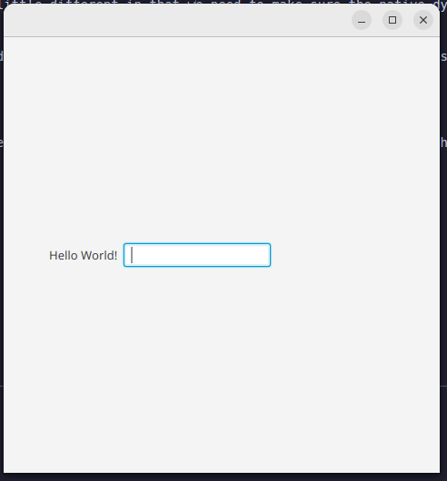

# HelloFx

This is an example "JavaFX" codebase built using the new [Grind](https://github.com/AnharHussainMiah/grind) build tool.

While `grind` uses Maven Artifact IDs to handle dependencies, JavaFx is a little different in that we need to make sure the native dynamic libraries (DLL/SO) files are included in the `src/main/resources` folder as well as the JavaFX Jar files in our usual `libs` folder.

This is easy enough, just download the JavaFX SDK and extract the `jar` and `so` files into the correct place. We fully automate this process
using `grind` task feature, see below

## How to compile, step 1 setup for JavaFX

Because we need to "patch" this project to incldue the required JavaFX dependencies, we can just use `grind` custom task to handle this for us:

```shell
$ grind task initJavafx
```

This will automatically download, extract and copy the required files into the correct folders.

And then you can build and run your project with the follwing command:

```shell
$ grind run
```



## Fat Jar

This works as normal using:

```shell
$ grind bundle
```

## NOTE

This example downloads the JavaFX for Linux, for Mac you will need to edit the custom task to download the Mac JavaFX instead, check out the `grind.yml`
